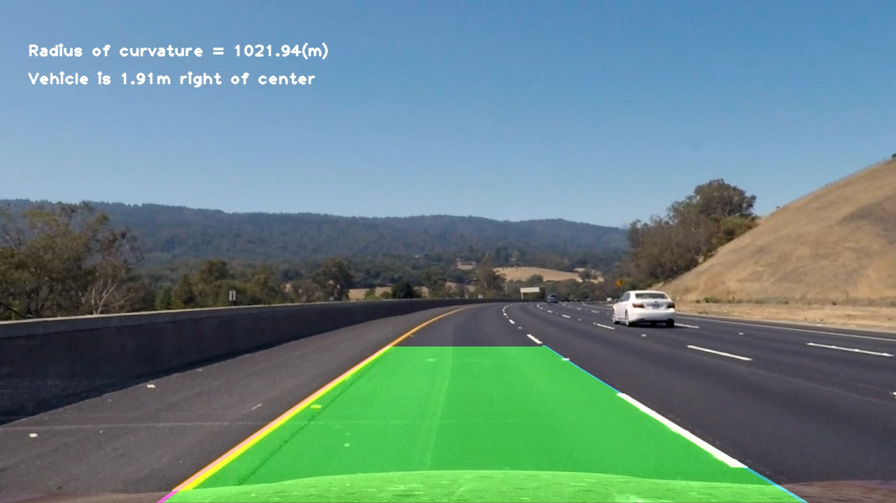

## **Advanced Lane Finding**

Overview
---

This Repo contains my files and other documents that make up the second project in the Self Driving Car Nano Degree Term 1.

Description of the files
---

    1.IPython Notebook : P2.ipynb    
    2.Test images provided : test_images directory
    3.Test images output directory : output_images directory
    Note: Output_images directory contains sub directories that contains the output from each step
    4.Videos provided : test_videos directory
    5.Output Videos : test_videos_output directory
    6.Write-UP File : writeup_chk.md
    7.Desired output : examples directory
    