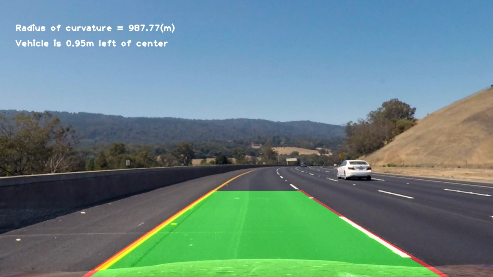

## **Advanced Lane Finding**

Overview
---

This submission is post review 1. The points mentioned in the review have been addressed as follows

1. The hyper parameters of the sliding window code were finely tuned and now the lane detection is much better than before.
2. Pl have a look at the test2_lane_drawn.jpg and compare it with the earlier one.
3. The distance from center values are also much better now.
4. I have included the new video output and the IPython notebook.

5. I am uploading the zip file unlike the github repo previously because my internet connection is bad
and git push is getting stuck with these huge files and the deadline is tomorrow.

Description of the files
---

    1.IPython Notebook : P2.ipynb  revised  
    2.Test images provided : lane_detected output images
    5.Output Video : project_video_output.mp4
    6.Write-UP File : Readme.Md(This file)
    